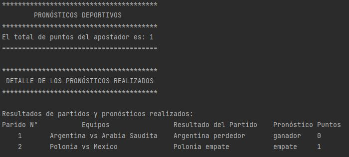
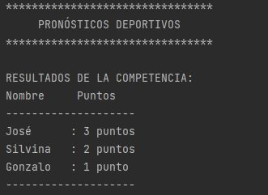
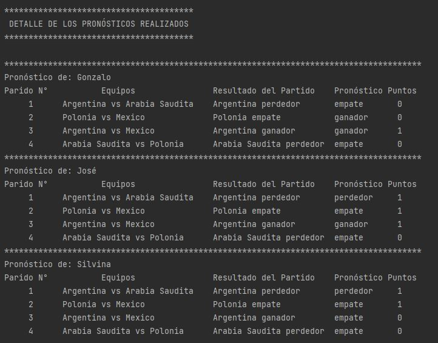

# Proyecto Integrador Java
## Pronósticos Deportivos
### Integrantes Grupo N° 4: 

- Acosta Silvina Fernanda
- Gonzalez Armando Jose Alejandro
- Rozas Gonzalo

### Introducción
Nos han solicitado el desarrollo de un programa de Pronósticos Deportivos.
Un pronóstico deportivo consta de un posible resultado de un partido (que un equipo gane, pierda o empate), propuesto por una persona que está participando de una competencia contra otras.
Cada partido tendrá un resultado. Este resultado se utilizará para otorgar puntos a los participantes de la competencia según el acierto de sus pronósticos.
Finalmente, quien gane la competencia será aquella persona que sume mayor cantidad de puntos.

### Consigna
La propuesta del trabajo práctico consiste en implementar un programa de consola que dada la información de resultados de partidos e información de pronósticos, ordene por puntaje obtenido a los participantes.

### Alcance
En este trabajo práctico nos limitaremos a pronosticar los resultados de los partidos, sin importar los goles ni la estructura del torneo (si es grupo, eliminatoria u otro); simplemente se sumarán puntos y se obtendrá un listado final.

### Etapa 1
A partir del esquema original propuesto, desarrollar un programa que lea un archivo de partidos y otro de resultados, el primero correspondiente a una ronda y el otro que contenga los pronósticos de una persona. Se considera una única ronda y un único participante en esta entrega
Cada ronda debe tener una cantidad fija de partidos, por ejemplo 2. 
El programa debe:
- Estar subido en un repositorio de GIT
- Tomar como argumento 2 rutas a cada archivo que se necesita
- Al leer las líneas de los archivos debe instanciar objetos de las clases propuestas
- Debe imprimir por pantalla el puntaje de la persona

### Ejemplo

Archivo **resultados.csv**

### Tables
Equipo 1  | Cant. goles 1  |  Cant. goles 2  |  Equipo 2
------------- |:-------------: |:-------------: |------------- |
Argentina  |  1  |	2  |  Arabia Saudita
Polonia  |	0  |  0  |  México

Archivo **pronosticos.csv**

Equipo 1  |	Gana 1  |  Empata  |  Gana 2  |  Equipo 2
------------- |:-------------: |:-------------: |:-------------: |------------- |
Argentina  |  X	 |     |     |  Arabia Saudita
Polonia  |     |  X  |     |  México

Leyendo los 2 (dos) archivos, y suponiendo que cada resultado acertado suma 1 (un) punto, la salida del programa debe ser: Puntaje = 1

### Salida por consola Etapa 1

### Etapa 2
En esta entrega se debe poder soportar que los archivos contengan información de muchas rondas y de muchas personas (para eso hay que agregar los datos de ronda y persona en los archivos correspondientes).
Por otro lado, al leer cada línea del archivo de resultados, se debe verificar que la misma sea correcta: número correcto de campos y que la cantidad de goles sea un número entero. Cada ronda puede tener cualquier cantidad de partidos.
Al finalizar el programa, se debe imprimir un listado de los puntajes de cada persona que participa.
El programa debe:
- Utilizar la herramienta Maven y su estructura de proyecto. La misma debe estar implementada en el repositorio de GIT escogido.
- Imprimir por pantalla el nombre de cada persona, el puntaje total y la cantidad de pronósticos acertados.
- Implementar un test (al menos uno, pero se recomienda hacer más) que calcule el puntaje de una persona en 2 (dos) rondas consecutivas.

### Ejemplo

Archivo **resultados.csv**

### Tables
Ronda |  Equipo 1  | Cant. goles 1  |  Cant. goles 2  |  Equipo 2
------------- |------------- |:-------------: |:-------------: |------------- |
1  |  Argentina  |  1  |	2  |  Arabia Saudita
1  |  Polonia  |	0  |  0  |  México
1  |  Argentina  |	2  |  0  |  México
1  |  Arabia Saudita  |	0  |  2  |  Polonia

Archivo **pronosticos.csv**

Participante |  Equipo 1  |	Gana 1  |  Empata  |  Gana 2  |  Equipo 2
------------- | ------------- |:-------------: |:-------------: |:-------------: |------------- |
Gonzalo  |  Argentina  |  	 |   X  |     |  Arabia Saudita
Gonzalo  |  Polonia  |  X  |    |     |  México
Gonzalo  |  Argentina  |  X  |     |     |  México
Gonzalo |  Arabia Saudita  |     |  X  |     |  Polonia
José  |  Argentina  |     |     |  X  |  Arabia Saudita
José  |  Polonia  |     |  X |    |  México
José  |  Argentina  |  X  |     |     |  México
José  |  Arabia Saudita  |     |  X  |     |  Polonia
Silvina  |  Argentina  |     |     |  X  |  Arabia Saudita
Silvina  |  Polonia  |     |  X |    |  México
Silvina  |  Argentina  |     |  X  |     |  México
Silvina  |  Arabia Saudita  |     |  X  |     |  Polonia

Leyendo los 2 (dos) archivos, y suponiendo que cada resultado acertado suma 1 (un) punto, la salida del programa debe ser:
José: 3 -
Silvina: 2 -
Gonzalo: 1

### Salida por consola Etapa 2

### Etapa 3
En esta entrega se deben poder leer los pronósticos desde una base de datos MySQL. Por otro lado, debe poder ser configurable la cantidad de puntos que se otorgan cuando se acierta un resultado (ganar, perder, empatar).
Finalmente, se agregan 2(dos) reglas para la asignación de puntajes de los participantes:
- Se suman puntos extra cuando se aciertan todos los resultados de una ronda.
- Se suman puntos extra cuando se aciertan todos los resultados de una fase (nuevamente, hace falta modificar los archivos para agregar este dato) sobre un equipo. Se debe considerar que una fase es un conjunto de rondas.

Se recomienda analizar qué estrategia se puede aplicar para incluir otras nuevas reglas con el menor impacto posible, de forma simple.
En esta entrega, el programa debe:
- Estar actualizado en el repositorio de Git.
- Recibir como argumento un archivo con los resultados y otro con configuración, por ejemplo: conexión a la DB, puntaje por partido ganado, puntos extra, etc.

